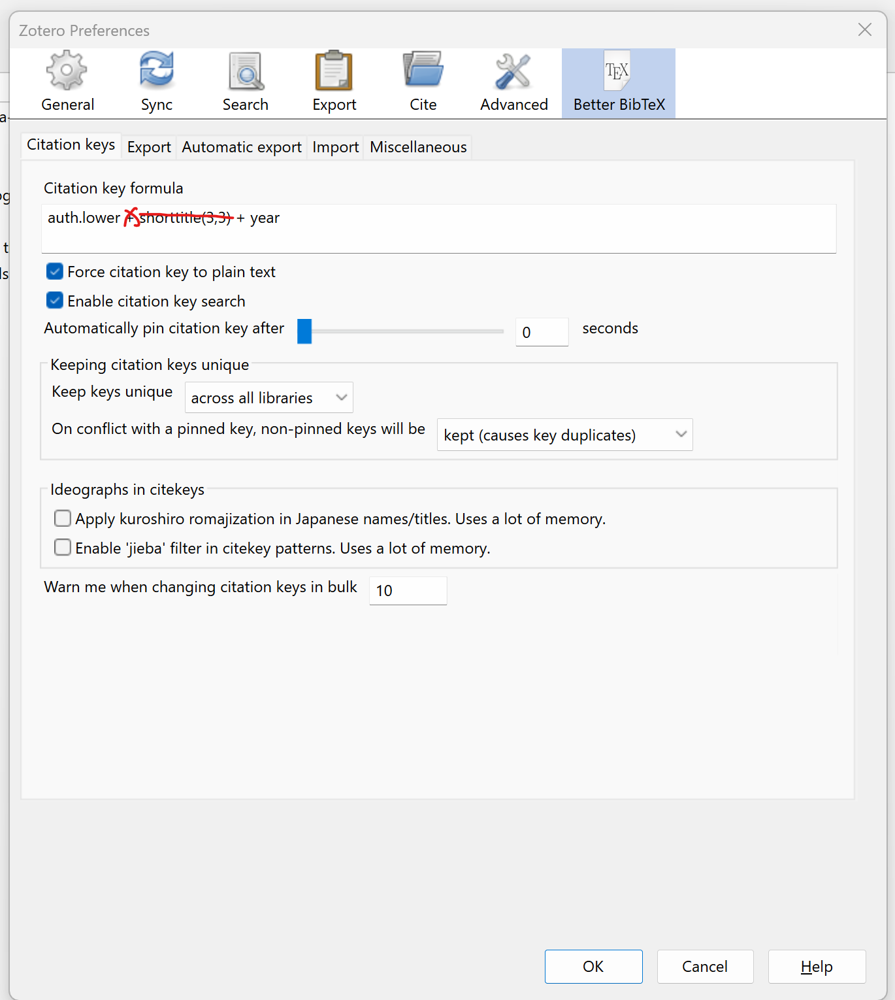

# Using visual editor is sort of like Typora

how do I insert citations? @bahr2015

Oh shit that wasn't so bad!

let's see if it renders on the blog

  

hmm weird the `{{ site.url }}{{ site.baseurl }}` doesn't stay put when moving back and forth from visual markdown editor in RStudio to source editor...
